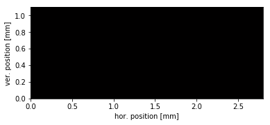

# WAXS_dynamic_cracktip_scan
Analysis of synchrotron scattering data obtained during 2D scan across a crack tip cycled at 1Hz
<b>Goal:<b> Map out the degree of crystallinity (caused by strain-induced crystallization) around a crack tip in a natural rubber sample cycled at 1 Hz. Broader context: Compare crystallinity at different loading conditions (static, dynamic) and relate it to material strength / failure modes.
<ul>
    <li>
        Rubber sample with crack mounted on dynamic tensile testing machine cycling at 1 Hz (rubber sample ca. 10mm x 2mm x 1mm, crack length 0.5mm)
    </li>
    <li>
        Microfocus X-ray beam, beam size much smaller than scan step size to reduce spatial blurring due to finite exposure time
    </li>
    <li>
   Diffraction data recorded at 50 Hz using Pilatus 300K detector, cbf format, total 50,000 images, images have time stamps, scan position is encoded in filenames
         </li>
    <li>
   Area scan across the sample
         </li>
    <li>
   Strain is not being recorded because tensile machine did not have this option. To overcome this problem, two metal fingers are mounted on the tensile machine that produce shadows on the X-ray detector, from the position of which the strain (nominal strain, elongation) can be computed.
         </li>
    <li>
   This script does the complete data processing from the raw data to the final animated gif showing the local relative degree of crystallinity around a crack tip while being cycled.
    </li>
   </ul>
Example two-dimensional diffraction data file with shadows: 

Reference: <a href="https://www.sciencedirect.com/science/article/pii/S0032386113008288">Brüning, K. Schneider, S.V. Roth, G. Heinrich: Strain-induced crystallization around a crack tip in natural rubber under dynamic load. Polymer 54 (2013), 6200</a>

<h3>Result:</h3>

<b>Legend:</b> 
white: background 
black: sample 
red: crystalline region 

